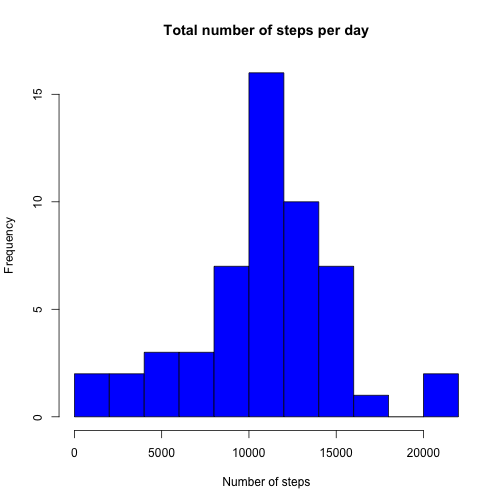
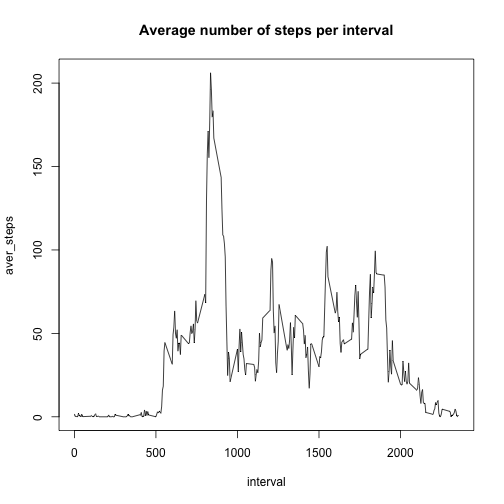
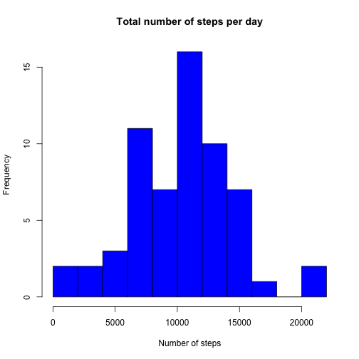
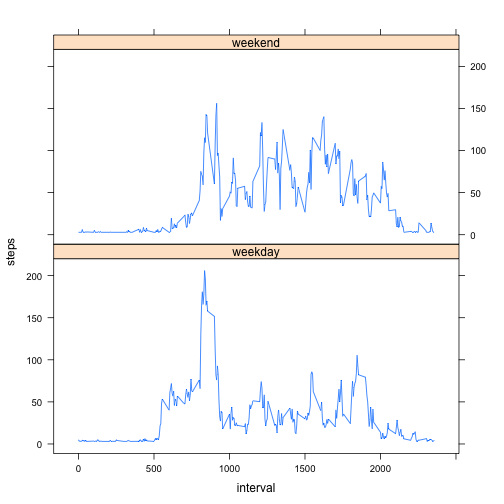

# Reproducible Research: Peer Assessment 1

## Loading and preprocessing the data
Loading the activity data and preprocessing for analysis. Need to make sure activity.csv is stored in the working directory.


```r
data <- read.csv(file="activity.csv", header=TRUE)
data$date <- as.Date(data$date, "%Y-%m-%d")
head(data)
```

```
##   steps       date interval
## 1    NA 2012-10-01        0
## 2    NA 2012-10-01        5
## 3    NA 2012-10-01       10
## 4    NA 2012-10-01       15
## 5    NA 2012-10-01       20
## 6    NA 2012-10-01       25
```

## What is mean total number of steps taken per day?
Calculating the total number of steps per day using the aggregate function. Making a histogram of steps taken per day as a function of number of days (frequency).


```r
stepsPerDay <- aggregate(steps ~ date, data=data, FUN=sum, na.rm=TRUE)
names(stepsPerDay) <- c("date", "total_steps")
hist(stepsPerDay$total_steps, breaks=10, col="blue", main="Total number of steps per day", xlab="Number of steps")
```



Calculating the mean and median value of total number of steps taken per day


```r
mean(stepsPerDay$total_steps)
```

```
## [1] 10766.19
```

```r
median(stepsPerDay$total_steps)
```

```
## [1] 10765
```

## What is the average daily activity pattern?
Making a time series plot of the 5-minute measurement intervals and the average number of steps taken per interval over all measured days


```r
stepsPerInterval <- aggregate(steps ~ interval, data=data, FUN=mean, na.rm=TRUE)
names(stepsPerInterval) <- c("interval", "aver_steps")
plot(stepsPerInterval, type="l", main="Average number of steps per interval")
```



Calculating which 5-minute interval, on average across all the days in the dataset, contains the maximum number of steps


```r
maxInterval <- which.max(stepsPerInterval$aver_steps)
stepsPerInterval$interval[maxInterval]
```

```
## [1] 835
```

## Imputing missing values
Calculating the total number of missing values in the dataset


```r
missingValues <- sum(is.na(data))
missingValues
```

```
## [1] 2304
```

Imputing missing values into the data set. Missing values will be substituted by the the mean for that day. If mean for the day is missing, then missing values will be replaced by the daily mean over the whole measurement period divided by number of measurements per day.


```r
missingVector <- is.na(data$steps)
stepsDayMean <- aggregate(steps ~ date, data=data, FUN=mean, na.rm=FALSE)
names(stepsDayMean) <- c("date", "steps_mean")
imputedData <- data

#impute missing values
for (i in 1:nrow(imputedData)){
        if (missingVector[i]==TRUE){
                date <- imputedData$date[i]
                date <- as.Date(date, "%Y-%m-%d")
        if (is.na(stepsDayMean$steps_mean[date])){
                imputedData$steps[i] <- mean(stepsPerDay$total_steps)/(2355/5)
        }
    else {
        imputedData$steps[i] <- stepsDayMean$steps_mean[date]
        }
        }
}
head(imputedData)
```

```
##      steps       date interval
## 1 22.85815 2012-10-01        0
## 2 22.85815 2012-10-01        5
## 3 22.85815 2012-10-01       10
## 4 22.85815 2012-10-01       15
## 5 22.85815 2012-10-01       20
## 6 22.85815 2012-10-01       25
```

Checking for complete cases to make sure all NAs were imputed with data according to devised strategy


```r
sum(complete.cases(data))
```

```
## [1] 15264
```

```r
sum(complete.cases(imputedData))
```

```
## [1] 17568
```

Making a histogram of the total number of steps taken each day from the imputed data set. Calculating new mean and median total number of steps taken per day. 


```r
stepsTotal <- aggregate(steps ~ date, data = imputedData, FUN=sum, na.rm=TRUE)
names(stepsTotal) <- c("date", "total_steps")
head(stepsTotal)
```

```
##         date total_steps
## 1 2012-10-01    6583.147
## 2 2012-10-02     126.000
## 3 2012-10-03   11352.000
## 4 2012-10-04   12116.000
## 5 2012-10-05   13294.000
## 6 2012-10-06   15420.000
```

```r
hist(stepsTotal$total_steps, breaks=10, col="blue", main="Total number of steps per day", xlab="Number of steps")
```



Calculating new mean and median values from the imputed data set


```r
mean(stepsTotal$total_steps)
```

```
## [1] 10217.59
```

```r
median(stepsTotal$total_steps)
```

```
## [1] 10395
```

We can see that imputing missing values with data according to chosen strategy above produces slightly lower values of mean and median for the new data set.

## Are there differences in activity patterns between weekdays and weekends?
Making a plot to show differences in activity patterns over weekdays and weekend days. Using the imputed data set with filled in values for missing values.


```r
#Enhancing the imputed data set with weekday and weekend day types
imputedData$day <- weekdays(imputedData$date)
imputedData$day_type <- c("weekday")

#Assign weekend label to Saturdays and Sundays
for (i in 1:nrow(imputedData)){
    if (imputedData$day[i] == "Saturday" || imputedData$day[i] == "Sunday"){
      imputedData$day_type[i] <- "weekend"
    }
}

stepsInterval <- aggregate(steps ~ interval + day_type, data=imputedData, FUN=mean)
names(stepsInterval) <- c("interval", "day_type", "steps")

library(lattice)
xyplot(steps ~ interval | day_type, stepsInterval, type = "l", layout = c(1, 2))
```


